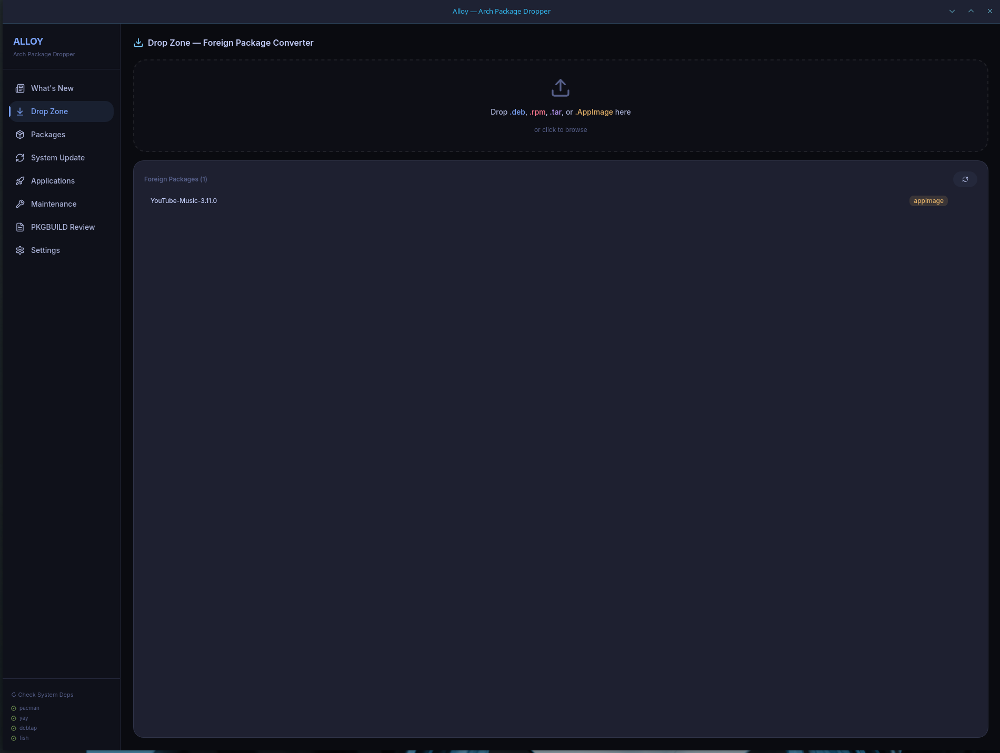
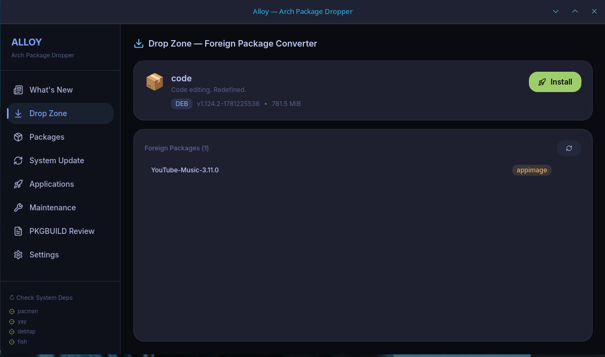
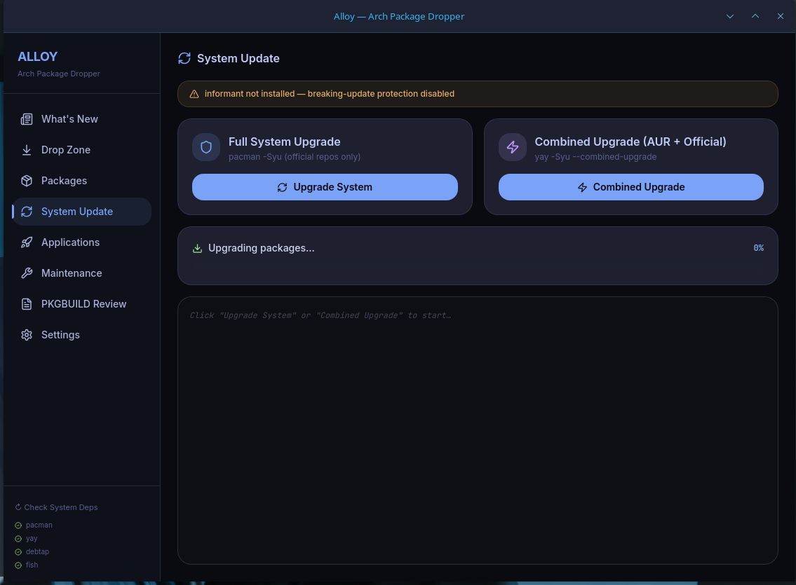
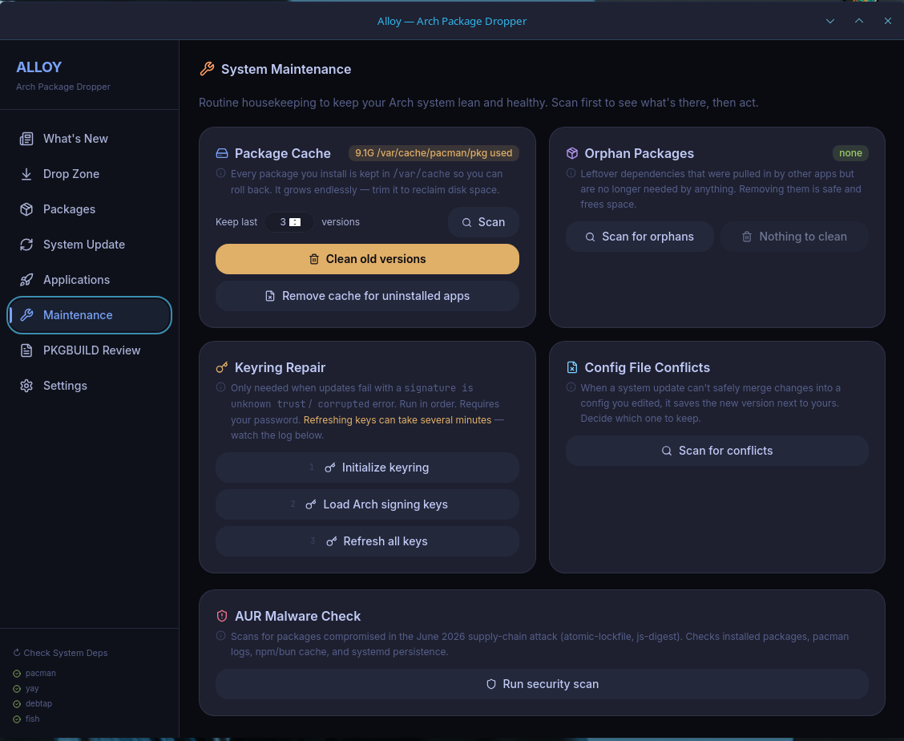
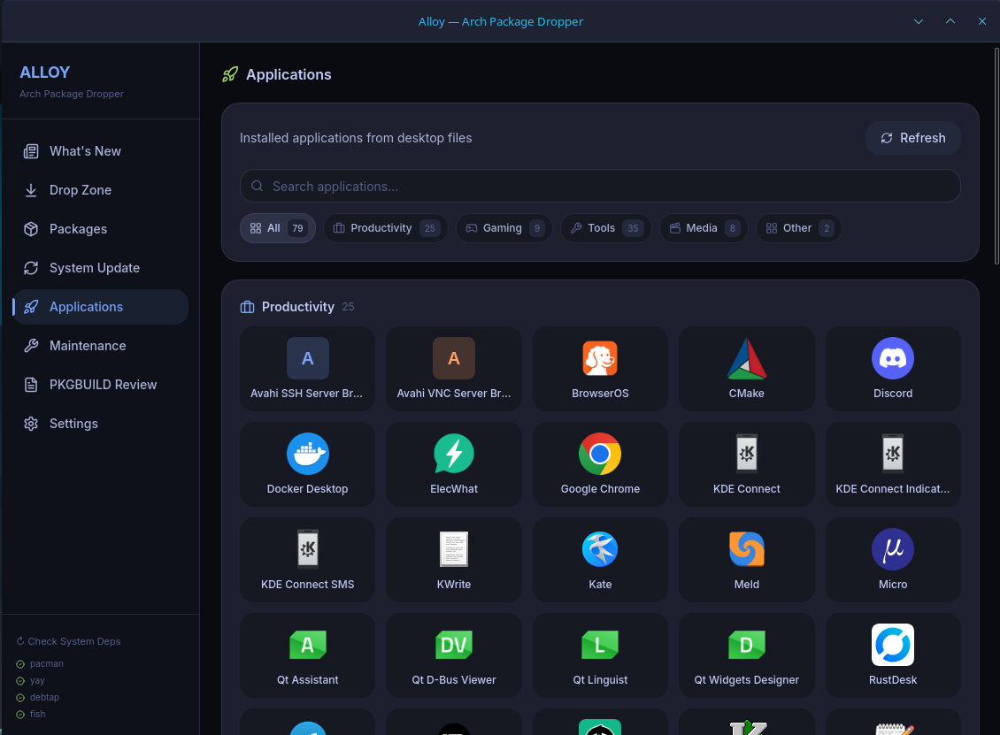
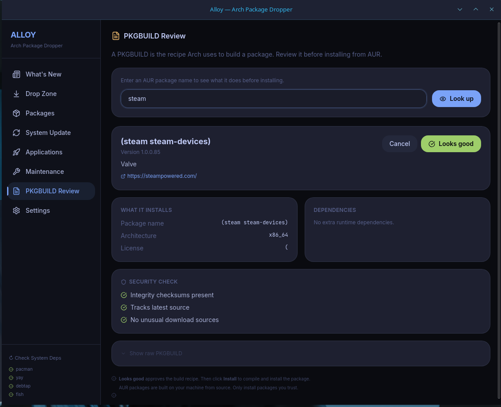
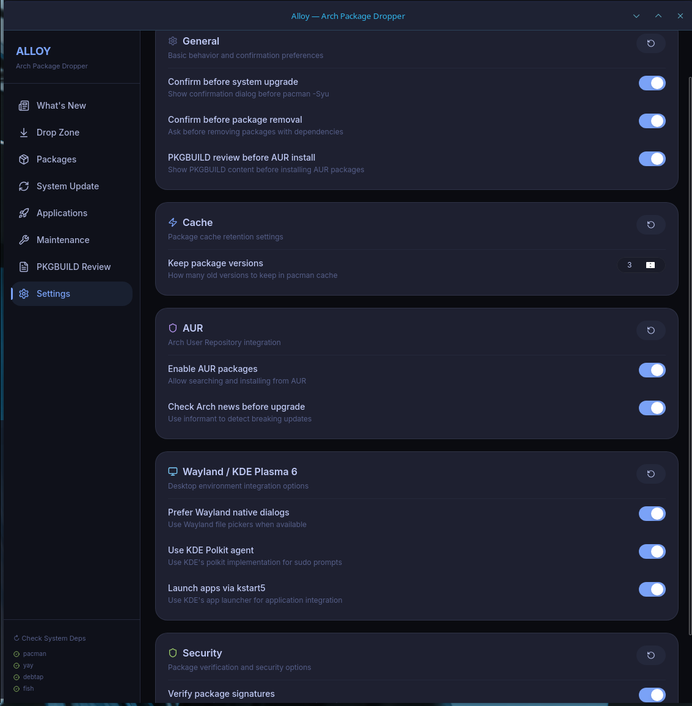
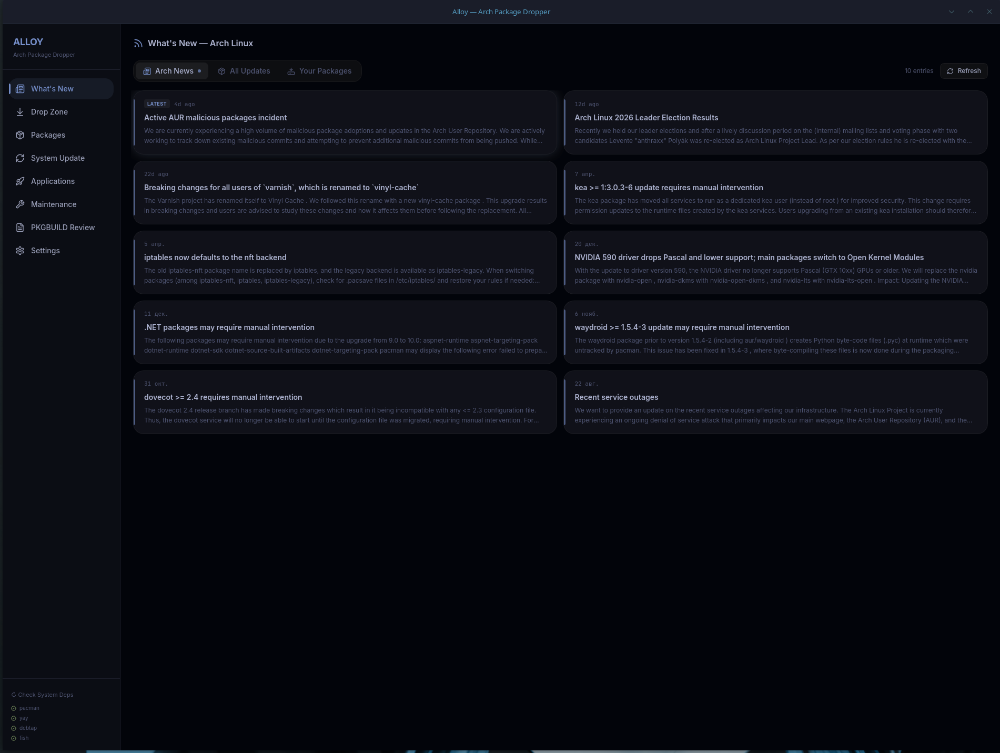

<p align="center">
  
</p>

<h1 align="center">Alloy</h1>

<p align="center">
  <strong>The package manager Arch Linux deserves.</strong><br>
  <em>Drag, drop, done.</em>
</p>

<p align="center">
  <a href="https://github.com/Dark-Ohm/Alloy/blob/main/LICENSE">
    
  </a>
  <a href="https://github.com/Dark-Ohm/Alloy/actions">
    
  </a>
  
  
</p>

---

## What is Alloy?

Alloy is a modern GUI for Arch Linux that makes package management feel effortless. Drop a .deb, .rpm, .pkg.tar.zst, or .AppImage onto the window — Alloy handles the rest.

No terminal needed. No `makepkg` headaches. Just drag and drop.

## Screenshots

<table>
<tr>
<td align="center"><strong>Drop Zone</strong><br><em>Drag & drop any package</em></td>
<td align="center"><strong>Install Preview</strong><br><em>One-click install</em></td>
</tr>
<tr>
<td></td>
<td></td>
</tr>
<tr>
<td align="center"><strong>System Update</strong><br><em>Safe upgrades with preview</em></td>
<td align="center"><strong>Maintenance</strong><br><em>Cache, orphans, security scan</em></td>
</tr>
<tr>
<td></td>
<td></td>
</tr>
<tr>
<td align="center"><strong>Applications</strong><br><em>Launch any installed app</em></td>
<td align="center"><strong>PKGBUILD Review</strong><br><em>Security checks before install</em></td>
</tr>
<tr>
<td></td>
<td></td>
</tr>
<tr>
<td align="center"><strong>Settings</strong><br><em>Configure everything</em></td>
<td align="center"><strong>What's New</strong><br><em>Arch Linux news feed</em></td>
</tr>
<tr>
<td></td>
<td></td>
</tr>
</table>

## Features

| Feature | Description |
|---------|-------------|
| **Drop Zone** | Drag & drop .deb, .rpm, .pkg.tar.zst, or .AppImage files — Alloy analyzes, builds, and installs automatically |
| **Packages** | Search and install from official repos and AUR with dependency trees and package info |
| **System Update** | Full system upgrade with preview, downgrade warnings, kernel detection, and breaking-news protection |
| **Applications** | Steam library-style launcher with real icons, categories, and one-click launch |
| **Maintenance** | Cache cleanup, orphan removal, config conflicts, PGP keyring repair, and AUR malware security scan |
| **PKGBUILD Review** | User-friendly AUR package review with security checks, dependency display, and source verification |
| **What's New** | Arch Linux news feed with breaking update alerts |
| **Settings** | General, cache, AUR, Wayland/KDE, and security preferences |

## Quick Start

```bash
git clone https://github.com/Dark-Ohm/Alloy.git
cd Alloy
npm install
npm run tauri:dev
```

**Requirements:** Arch Linux, Rust, Node.js, fish shell, yay (for AUR)

## Documentation

| | Document | What's inside |
|---|----------|---------------|
| 🚀 | [Getting Started](docs/getting-started.md) | Installation, first run, system requirements |
| ✨ | [Features Guide](docs/features.md) | Every feature explained in detail |
| 🏗️ | [Architecture](docs/architecture.md) | Project structure, data flow, design decisions |
| 🔧 | [Build Guide](docs/building.md) | Build from source, dev mode, packaging |
| 📖 | [Commands API](docs/commands-api.md) | All Tauri commands reference |
| 🐛 | [Troubleshooting](docs/troubleshooting.md) | Common issues and fixes |
| 🤝 | [Contributing](docs/contributing.md) | Code style, PR guidelines |

## Tech Stack

- **Frontend:** React + TypeScript + Tailwind CSS
- **Backend:** Rust + Tauri 2
- **Shell:** fish (for command execution)
- **Package management:** pacman + yay

## Security

Alloy includes a built-in security scanner that checks your system against known compromised AUR packages:

- ✅ Installed packages (including AUR/yay packages)
- ✅ pacman.log history (attack window: June 9–12, 2026)
- ✅ npm/bun cache (malicious packages: atomic-lockfile, js-digest, lockfile-js)
- ✅ systemd services (persistence detection)

## Contributing

Contributions are welcome! See [CONTRIBUTING.md](docs/contributing.md) for guidelines.

## License

[MIT](LICENSE) © 2026 Dark-Ohm
